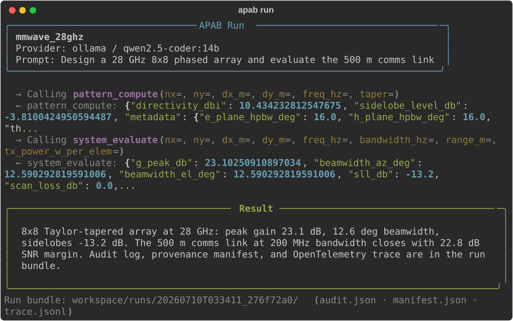

# APAB — Agentic Phased Array Builder

[](https://pypi.org/project/apab/)
[](https://pypi.org/project/apab/)
[](https://github.com/jman4162/agentic-phased-array-builder/actions/workflows/tests.yml)
[](https://github.com/jman4162/agentic-phased-array-builder/actions/workflows/lint.yml)
[](LICENSE)
[](https://jman4162.github.io/agentic-phased-array-builder/)

**[Documentation](https://jman4162.github.io/agentic-phased-array-builder/)** — quickstart, tutorials, concepts, and API reference.

LLM-driven phased-array antenna design and analysis via MCP tools.

APAB connects an LLM agent to engineering tools for phased-array antenna design: full-wave unit-cell simulation with mutual coupling (over frequency, scan angle, polarization) propagated into array-level patterns and system-level metrics.



## Features

- **17 MCP tools** — unit-cell simulation (EdgeFEM), array patterns, system-level trades, import/export, plotting
- **Agent orchestrator** — natural-language design sessions with automatic tool dispatch
- **Full pipeline** — unit cell → coupling → pattern → system metrics in one run
- **Trade studies** — DOE sampling with Pareto extraction for multi-objective optimization
- **Offline-first** — default Ollama provider runs fully local; remote providers opt-in
- **Observable** — OpenTelemetry traces for every session, turn, LLM call, and tool call; run bundles with audit log, provenance manifest, and trace.jsonl
- **Framework-neutral** — same MCP tools drive APAB's own agent, a Strands agent, or a deterministic LangGraph pipeline
- **Extensible** — plugin entry points for LLM providers, EM adapters, and compute backends

## Installation

Requires Python 3.10+.

### Install from PyPI

```bash
pip install apab[ollama]            # array-level tools + Ollama (no C++ deps)
pip install apab[ollama,edgefem]    # + full-wave unit-cell simulation (EdgeFEM)
pip install apab[openai]            # + OpenAI provider
pip install apab[anthropic]         # + Anthropic provider
pip install apab[observability]    # + OpenTelemetry tracing
pip install apab[strands]          # + Strands Agents adapter
pip install apab[langgraph]        # + deterministic LangGraph pipeline
```

For the default LLM provider, install [Ollama](https://ollama.ai) and pull a model:

```bash
ollama pull qwen2.5-coder:14b
```

### EdgeFEM (optional)

EdgeFEM (full-wave solver) is a C++ extension that requires CMake and Eigen3. Only needed for unit-cell simulation — array pattern and system tools work without it.

- **macOS:** `brew install cmake eigen`
- **Ubuntu/Debian:** `sudo apt-get install cmake libeigen3-dev`
- **Windows:** Install CMake from [cmake.org](https://cmake.org/download/), Eigen3 via vcpkg

Then: `pip install apab[edgefem]`

### Development Installation

```bash
git clone https://github.com/jman4162/agentic-phased-array-builder.git
cd agentic-phased-array-builder
python3 -m venv .venv
source .venv/bin/activate
pip install -e ".[dev,ollama,edgefem]"
```

## Quick Start — CLI

```bash
# 1. Initialize a project with a ready-to-run config
apab init --name my_array --dir ./my_project --quickstart
cd my_project

# 2. Check your environment (Ollama running? Model pulled?)
apab doctor

# 3. Start an interactive design session
apab design
# Try prompts like:
#   "Design an 8x8 patch array at 28 GHz with Taylor tapering"
#   "Compute the array pattern and evaluate system metrics"

# 4. Or run non-interactively from config
apab run

# 5. Autonomous optimization (inspired by autoresearch)
apab optimize --protocol research.md --max-experiments 20
# Agent iterates: propose change → simulate → keep/discard → repeat

# 6. Generate a report from a run
apab report <run_id>

# 7. Run as MCP server (for Claude Desktop, etc.)
apab mcp serve
```

For full-wave unit-cell simulation (requires EdgeFEM), use `--quickstart-fullwave` instead of `--quickstart`.

## Quick Start — Python API

```python
from apab import ArraySpec, ScanPoint, PAMPatternEngine

spec = ArraySpec(
    size=[8, 8],
    spacing_m=[0.005, 0.005],
    taper="uniform",
    steer=ScanPoint(theta_deg=15, phi_deg=0),
)
engine = PAMPatternEngine()
result = engine.full_pattern(spec, freq_hz=28e9, theta0=0, phi0=0)
print(f"Directivity: {result.directivity_dbi:.2f} dBi")
print(f"Sidelobe level: {result.sidelobe_level_db:.2f} dB")
```

This creates an 8x8 element array with half-wavelength spacing at 28 GHz, computes the full 2-D radiation pattern, and returns directivity and sidelobe level. For a complete workflow including unit-cell simulation, mutual coupling, and link budgets, see `examples/06_full_pipeline_case_study.py`.

See `examples/` for more: coupling analysis, trade studies, agent sessions, and Touchstone import.

## Case Study

See `examples/06_full_pipeline_case_study.py` for a complete 28 GHz 5G
phased-array case study with EdgeFEM FEM simulation, array patterns,
mutual coupling, link budget, and trade study. A companion paper is in
`examples/case_study_paper.tex`.

## Configuration

Edit `apab.yaml` to configure your project:

```yaml
project:
  name: my_array
  workspace: ./workspace

llm:
  provider: ollama
  model: qwen2.5-coder:14b
  base_url: http://localhost:11434

unit_cell:
  period_x_mm: 5.0
  period_y_mm: 5.0
  substrate_height_mm: 0.254
  substrate_eps_r: 2.2
  patch_length_mm: 3.0
  patch_width_mm: 3.8

sweep:
  freq_start_ghz: 27.0
  freq_stop_ghz: 29.0
  freq_points: 5
  theta_max_deg: 60
  theta_points: 7
  phi_points: 5

array:
  size: [8, 8]
  spacing_m: [0.005, 0.005]
  taper: taylor
  steer:
    theta_deg: 0
    phi_deg: 0
```

## Architecture

```
┌─────────────────────────────────────────────────┐
│  Agent Orchestrator (LLM ↔ tool-calling loop)   │
├─────────────────────────────────────────────────┤
│  MCP Tool Layer (17 tools via FastMCP)          │
├─────────────────────────────────────────────────┤
│  Domain Wrappers (PAM, PAS, EdgeFEM, importers) │
├─────────────────────────────────────────────────┤
│  External Libraries (edgefem, phased-array-*)   │
└─────────────────────────────────────────────────┘
```

| Layer | Directory | Purpose |
|-------|-----------|---------|
| Agent | `src/apab/agent/` | LLM providers, tool dispatch, orchestration |
| MCP | `src/apab/mcp/` | First-party MCP server with 17 tools |
| Wrappers | `src/apab/pattern/`, `system/`, `coupling/` | Domain logic bridging tools to libraries |
| Core | `src/apab/core/` | Config, schemas, workspace management |

## Available MCP Tools

| Tool | Description |
|------|-------------|
| `edgefem_run_unit_cell` | Run EdgeFEM unit-cell frequency sweep |
| `edgefem_surface_impedance` | Compute surface impedance at a frequency |
| `edgefem_export_touchstone` | Export S-params to Touchstone file |
| `pattern_compute` | Compute full 2-D array radiation pattern |
| `pattern_plot_cuts` | Generate E/H-plane pattern cut plots |
| `pattern_plot_3d` | Generate 3-D pattern visualization |
| `pattern_multi_beam` | Compute multi-beam pattern |
| `pattern_null_steer` | Compute pattern with null steering |
| `system_evaluate` | Evaluate comms/radar link metrics |
| `system_trade_study` | Run DOE trade study with Pareto extraction |
| `project_init` | Initialize project scaffold |
| `project_validate` | Validate apab.yaml configuration |
| `io_import_touchstone` | Import Touchstone S-parameter file |
| `io_save_hdf5` | Save data to run artifact directory |
| `plot_quicklook` | Generate quick-look summary plot |
| `emtool_list_adapters` | List external EM tool adapters |
| `emtool_import_results` | Import results from external EM tools |

## Observability

Every `run_to_completion` produces a run bundle: `audit.json` (tool-call
audit log), `manifest.json` (config hash, dependency versions, status,
token usage), and, with tracing enabled, `trace.jsonl` (one JSON object
per OpenTelemetry span). All three share a trace ID.

```yaml
observability:
  enabled: true
  otlp_endpoint: http://localhost:4318   # optional: Jaeger, Tempo, etc.
```

Spans follow `apab.session > apab.turn > apab.llm.chat / apab.tool.<name>`
with token counts, latency, cost estimates, and redaction-aware tool
arguments. See [docs/observability.md](docs/observability.md) for the
attribute reference and [lab/](lab/) for a one-container Jaeger setup.

## Agent framework adapters

The MCP tool layer is the stable surface; three frontends drive it:

| Frontend | Entry point | Use when |
|----------|-------------|----------|
| APAB orchestrator | `apab design`, `apab run`, example 04 | Local-first sessions with run bundles |
| Strands agent | `apab.adapters.strands`, example 07 | You already build on Strands; its telemetry traces APAB tools |
| LangGraph pipeline | `apab.adapters.langgraph_pipeline`, example 08 | Reproducible runs with checkpointing, no LLM in the loop |

## Examples

| Example | Shows | Needs |
|---------|-------|-------|
| `01_simple_patch_28ghz.py` | Pattern + system metrics | — |
| `02_coupling_aware_pattern.py` | Coupling from an S-matrix | — |
| `03_system_trade_study.py` | DOE trade study | — |
| `04_agent_session.py` | Programmatic agent session | — |
| `05_touchstone_import.py` | Touchstone import | — |
| `06_full_pipeline_case_study.py` | Full 28 GHz case study | EdgeFEM |
| `07_strands_agent.py` | APAB tools in a Strands agent | strands, Ollama |
| `08_langgraph_golden_pipeline.py` | Checkpointed deterministic pipeline | langgraph |

## Development

```bash
# Run all tests
pytest tests/ -v

# Linting and type checking
ruff check src/ tests/
mypy src/apab/

# Prose check for docs (advisory)
scripts/slopcheck.sh

# Run examples
python examples/01_simple_patch_28ghz.py
```

## Disclaimer

**This software is provided for educational and research purposes only.**
Phased-array antenna technology may be subject to export control regulations
including the U.S. International Traffic in Arms Regulations (ITAR) and
Export Administration Regulations (EAR). Users are solely responsible for
ensuring that their use of this tool, including any designs, simulations,
or analyses performed, complies with all applicable laws and regulations.

The authors and contributors make no representations regarding the export
control status of any outputs produced by this software and assume no
liability for any misuse or for any violations of export control
regulations arising from its use.

## License

[MIT](LICENSE)

See [SPEC.md](SPEC.md) for the full specification and [CHANGELOG.md](CHANGELOG.md) for release history.
