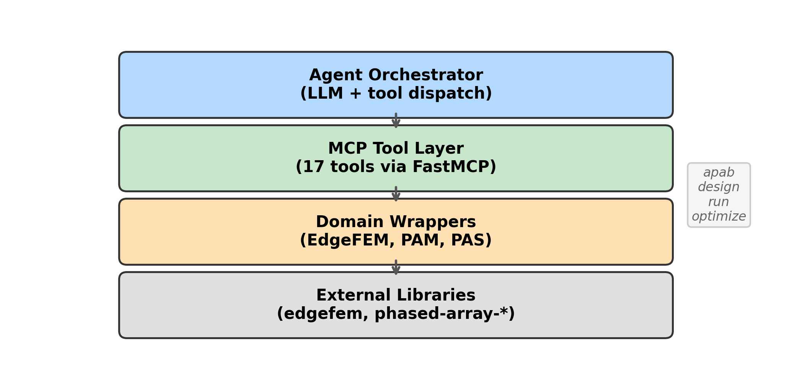

# Summary

APAB (Agentic Phased Array Builder) is an open-source Python toolkit that
connects a large language model (LLM) agent to engineering analysis tools for
phased-array antenna design. The agent autonomously selects and invokes
tools---full-wave electromagnetic simulation, array pattern synthesis, mutual
coupling estimation, system-level link budgets, and design-of-experiments trade
studies---via the Model Context Protocol (MCP) [@mcp2024], a standardized
interface for LLM tool interaction. APAB requires no manual scripting to
execute a complete design workflow: a user describes a design intent in natural
language, and the agent decomposes it into tool calls, handles errors, and
returns a structured analysis with key performance metrics.

The toolkit supports five LLM providers (Ollama, OpenAI, Anthropic, Google
Gemini, and any OpenAI-compatible endpoint) and runs fully offline with a local
Ollama instance by default. An autonomous optimization mode, inspired by
Karpathy's autoresearch framework [@karpathy2026], iteratively proposes design
modifications, evaluates them against a user-defined metric and constraints,
and retains only improvements---enabling overnight unattended design
exploration.

# Statement of Need

Phased-array antenna design for 5G millimeter-wave communications requires
coordinating multiple analysis domains: unit-cell electromagnetic simulation,
array factor computation with amplitude tapering, mutual coupling and active
impedance analysis, and system-level link budget evaluation
[@balanis2016; @mailloux2017]. In practice, each domain is served by a separate
tool with distinct data formats and interfaces, making end-to-end analysis
fragmented, error-prone, and difficult to reproduce.

Existing commercial tools (HFSS, CST, FEKO) provide integrated environments
but are proprietary, expensive, and not designed for LLM-driven automation.
Open-source alternatives exist for individual analysis steps---EdgeFEM
[@edgefem2026] for finite-element simulation, phased-array-modeling for
pattern computation---but no framework integrates them into a single automated
pipeline accessible via natural language.

APAB addresses this gap by providing:

- **17 MCP tools** spanning unit-cell simulation (EdgeFEM), array patterns,
  system-level trades, import/export, and visualization
- **An agent orchestrator** that chains tools autonomously via LLM
  tool-calling, with error recovery and audit logging
- **An autonomous optimization loop** where the LLM proposes, evaluates, and
  iterates on design parameters against user-defined objectives
- **Full reproducibility** through deterministic run bundles with provenance
  tracking

The toolkit is designed for antenna engineers, RF researchers, and students
who want to rapidly explore phased-array design spaces without writing
integration scripts.

# Architecture

APAB is organized in four layers (\autoref{fig:arch}):

1. **Agent Orchestrator** --- Manages the LLM conversation loop, dispatches
   tool calls, and tracks run context. Supports multiple LLM providers via a
   plugin entry-point system.
2. **MCP Tool Layer** --- 17 tools registered on a FastMCP server, each
   accepting validated Pydantic schemas and returning structured JSON results.
3. **Domain Wrappers** --- Python modules that bridge MCP tool schemas to
   external library APIs (EdgeFEM, phased-array-modeling, phased-array-systems).
4. **Artifact Layer** --- Run bundles containing configuration, logs, audit
   trails, and output artifacts for reproducibility.

The `apab optimize` command implements the autonomous optimization loop: the
agent reads a human-authored research protocol (defining objectives,
constraints, and strategy), proposes a single design modification per
experiment, evaluates it via MCP tools, and records the result as "keep" or
"discard" in a TSV log. The agent sees its own experiment history and builds on
what worked, effectively using the LLM as a surrogate model for the design
space.

# Key Features

- **CLI commands**: `apab init`, `apab doctor` (environment health checks),
  `apab design` (interactive), `apab run` (non-interactive), `apab optimize`
  (autonomous loop), `apab report`, `apab mcp serve`
- **EdgeFEM optional**: Array-level tools work without C++ build dependencies;
  full-wave simulation available via `pip install apab[edgefem]`
- **Offline-first**: Default provider is Ollama with a local model
  (qwen2.5-coder:14b), requiring no API keys or internet access
- **Extensible**: Plugin entry points for LLM providers
  (`apab.llm_providers`), EM adapters (`apab.em_adapters`), and compute
  backends (`apab.compute_backends`)
- **Tested**: 293 passing tests covering all layers, validated end-to-end
  with real Ollama on Apple M3 Pro hardware

A 28 GHz case study demonstrating the full pipeline---unit-cell FEM
simulation, Taylor-tapered array pattern, mutual coupling, link budget, and
40-point Latin Hypercube trade study---is included in the repository with
publication-quality figures and a companion LaTeX paper.

# Acknowledgements

The author thanks the developers of EdgeFEM, phased-array-modeling,
phased-array-systems, and the Model Context Protocol specification for
providing the foundational tools and standards that APAB integrates.

# References
